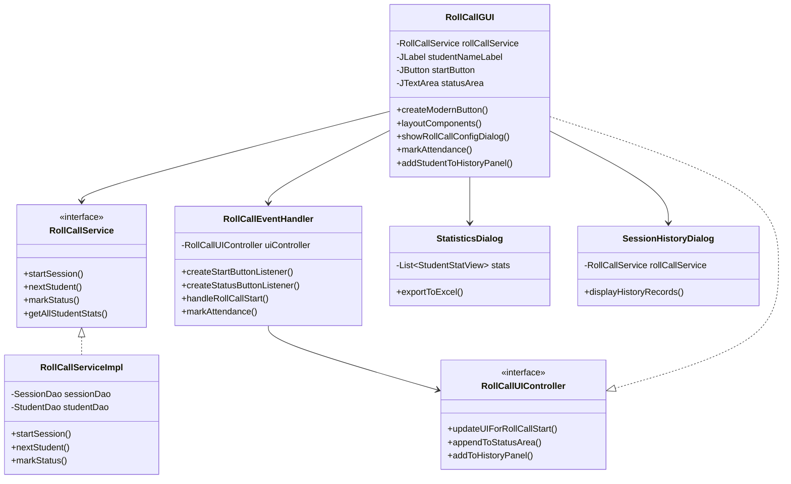
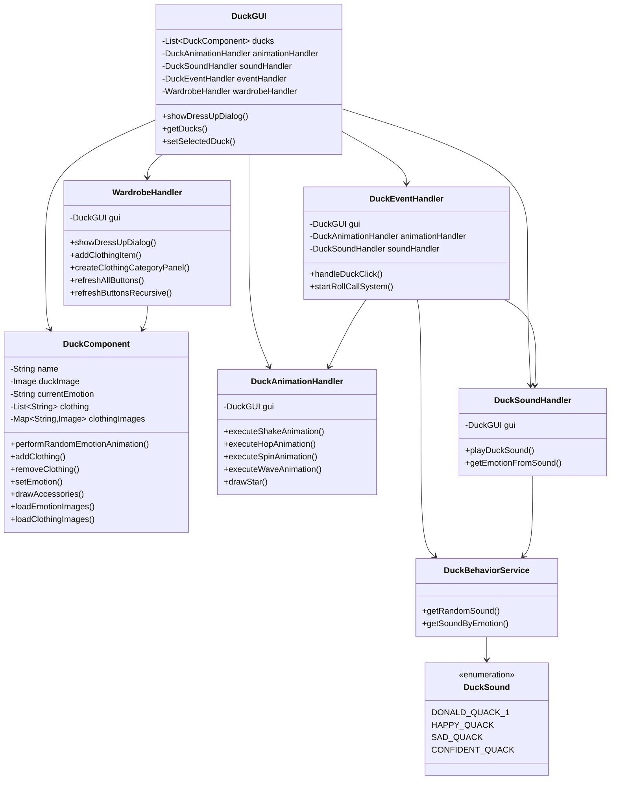

# 前端模块修改汇报报告

## 整体介绍

本次前端模块修改主要集中在两大核心功能模块：**点名系统**和**换装系统**。通过对代码的深度重构和功能增强，实现了用户界面的现代化升级、交互体验的显著提升，以及代码架构的优化。修改严格遵循软件工程最佳实践，采用模块化设计、事件驱动编程等设计模式，大幅提升了代码的可维护性和扩展性。

## 核心类作用表

### 点名系统核心类

| 类名 | 类型 | 主要职责 | 核心方法 |
|------|------|----------|----------|
| **RollCallGUI** | 主界面类 | 点名系统UI控制器，负责整体界面布局和用户交互 | `createModernButton()`, `layoutComponents()`, `showRollCallConfigDialog()` |
| **RollCallEventHandler** | 事件处理类 | 统一处理点名系统所有用户交互事件 | `createStartButtonListener()`, `handleRollCallStart()`, `markAttendance()` |
| **RollCallUIController** | 接口 | 定义UI控制器方法，实现关注点分离 | `updateUIForRollCallStart()`, `appendToStatusArea()`, `addToHistoryPanel()` |
| **RollCallService** | 服务接口 | 定义点名业务逻辑接口 | `startSession()`, `nextStudent()`, `markStatus()` |
| **RollCallServiceImpl** | 服务实现类 | 实现点名业务逻辑，处理数据持久化 | `startSession()`, `nextStudent()`, `markStatus()` |
| **StatisticsDialog** | 统计对话框 | 展示学生考勤统计信息，支持Excel导出 | `exportToExcel()`, `displayStatistics()` |
| **SessionHistoryDialog** | 历史记录对话框 | 显示点名会话历史记录 | `displayHistoryRecords()`, `filterByDate()` |

### 换装系统核心类

| 类名 | 类型 | 主要职责 | 核心方法 |
|------|------|----------|----------|
| **DuckGUI** | 主界面类 | 换装系统UI控制器，管理小鸭子组件和处理器 | `showDressUpDialog()`, `getDucks()`, `setSelectedDuck()` |
| **DuckComponent** | 组件类 | 小鸭子可视化组件，处理图片渲染和状态管理 | `performRandomEmotionAnimation()`, `addClothing()`, `drawAccessories()` |
| **WardrobeHandler** | 换装处理器 | 管理服装换装逻辑和界面交互 | `showDressUpDialog()`, `createClothingCategoryPanel()`, `refreshAllButtons()` |
| **DuckAnimationHandler** | 动画处理器 | 处理小鸭子各种动画效果 | `executeShakeAnimation()`, `executeHopAnimation()`, `drawStar()` |
| **DuckSoundHandler** | 声音处理器 | 管理小鸭子音效播放和情绪映射 | `playDuckSound()`, `getEmotionFromSound()` |
| **DuckEventHandler** | 事件处理器 | 处理小鸭子点击事件和交互逻辑 | `handleDuckClick()`, `startRollCallSystem()` |
| **DuckBehaviorService** | 行为服务 | 管理鸭子行为和声音逻辑 | `getRandomSound()`, `getSoundByEmotion()` |
| **DuckSound** | 枚举类 | 定义鸭子声音类型和情绪状态 | `DONALD_QUACK_1`, `HAPPY_QUACK`, `SAD_QUACK` |

## 一、点名系统

### 整体概述
点名系统是一个功能完备的课堂考勤管理工具，支持全点和抽点两种模式，具备多种点名策略，并提供实时的语音播报和可视化反馈。系统采用MVC架构设计，界面美观现代，操作流畅直观。

### 系统架构类图



### 实现功能与技术实现

#### 1. 现代化界面设计
**实现功能**：采用现代化UI设计风格，提供美观直观的用户界面
**详细技术实现**：
- **RollCallGUI类**：主界面类，负责整体界面布局和用户交互
  - `createModernButton()`方法：
    - 重写`paintComponent()`方法实现圆角按钮效果
    - 使用`RenderingHints.KEY_ANTIALIASING`实现抗锯齿
    - 动态颜色切换：鼠标按下时变深色，正常时显示背景色
    - 统一按钮样式：圆角弧度10，内边距(10,20)，无焦点框
  - `layoutComponents()`方法：
    - 采用`GridBagLayout`实现复杂响应式布局
    - 使用`GridBagConstraints`精确控制组件位置和大小
    - 左右分区设计：左侧点名区，右侧历史记录区
  - 现代化配色方案：
    - 主色调蓝色(52,152,219)：用于主要按钮和标题
    - 成功色绿色(46,204,113)：用于出勤按钮
    - 危险色红色(231,76,60)：用于旷课按钮
    - 警告色橙色(241,196,15)：用于请假按钮
    - 信息色蓝色(52,152,219)：用于查看统计按钮

#### 2. 智能点名配置
**实现功能**：支持灵活的点名配置，包括点名方式、人数选择和点名策略
**详细技术实现**：
- **showRollCallConfigDialog()方法**：创建功能完备的配置对话框
  - 点名方式选择：
    - 使用`JComboBox<CallType>`枚举选择：`CallType.ALL`(全点)、`CallType.RANDOM`(抽点)
    - 动态启用/禁用：全点时禁用策略和人数选择
  - 人数选择面板：
    - 固定选项：10人、15人、20人单选按钮
    - 自定义输入：`JTextField`支持手动输入人数
    - 输入验证：检查输入是否为有效正整数，是否超过总人数
  - 点名策略选择：
    - `JComboBox<StrategyType>`：随机、旷课最多、点到最少三种策略
    - 策略描述：`getStrategyDescription()`方法提供人性化的策略说明
  - 配置验证逻辑：
    - 数据库验证：查询学生总数作为人数上限
    - 实时验证：自定义输入框失去焦点时验证输入有效性
    - 错误提示：使用`JOptionPane`显示具体的错误信息

#### 3. 实时点名流程
**实现功能**：支持异步点名处理，避免UI阻塞，提供实时反馈
**详细技术实现**：
- **异步处理机制**：
  ```java
  SwingWorker<NextCall, Void> worker = new SwingWorker<>() {
      @Override
      protected NextCall doInBackground() throws Exception {
          // 后台线程执行业务逻辑
          return rollCallService.nextStudent(currentSessionId);
      }
      
      @Override
      protected void done() {
          // UI线程更新界面
          try {
              NextCall next = get();
              displayStudentInfo(next.getStudent());
          } catch (Exception ex) {
              JOptionPane.showMessageDialog(RollCallGUI.this, 
                  "获取下一个学生失败：" + ex.getMessage(), 
                  "错误", JOptionPane.ERROR_MESSAGE);
          }
      }
  };
  worker.execute();
  ```
- **displayStudentInfo()方法**：动态显示学生信息
  - 照片加载：从`/students_picture/`目录加载学生照片
  - 图片缩放：使用`Image.SCALE_SMOOTH`保持图片质量
  - 错误处理：照片加载失败时显示"无照片"提示
- **语音播报功能**：
  - 跨平台支持：macOS使用`say`命令，Windows使用PowerShell
  - 异步执行：在SwingWorker中执行语音播报，避免阻塞UI
  - 异常处理：语音播报失败不影响点名流程

#### 4. 历史记录管理
**实现功能**：实时显示本次点名记录，支持状态转换操作
**详细技术实现**：
- **addStudentToHistoryPanel()方法**：创建动态学生卡片
  - 卡片布局：`BorderLayout`布局，左侧信息，右侧操作按钮
  - 状态颜色映射：
    - 出勤：跳过显示(绿色学生不显示在历史记录中)
    - 旷课：红色文字，提供"转为迟到"按钮
    - 请假：蓝色文字
    - 迟到：橙色文字
  - 转换按钮：为旷课学生提供状态转换功能
- **markAttendance()方法**：智能考勤状态处理
  - 迟到转换逻辑：
    1. 先检查当前记录状态：通过`RecordDao.findById()`获取最新状态
    2. 验证转换条件：只有旷课状态且在10分钟内才能转为迟到
    3. 时间计算：`computeLateMinutes()`计算迟到分钟数
    4. 状态更新：`adjustStatAbsentToLate()`更新统计数据
  - 时间戳记录：使用`Timestamp`精确记录响应时间
- **实时更新机制**：
  - 自动滚动：`SwingUtilities.invokeLater()`确保滚动到最新记录
  - 状态同步：转换操作后立即更新卡片显示和按钮状态

#### 5. 统计与导出功能
**实现功能**：提供多维度的考勤统计和数据导出
**详细技术实现**：
- **showCurrentSessionStatistics()方法**：自动显示本次点名统计
  - 会话统计：自动创建`SessionStatisticsDialog`显示当前会话数据
  - 触发时机：点名结束后自动弹出统计对话框
- **StatisticsDialog类**：综合统计信息展示
  - 数据展示：使用`JTable`展示学生统计信息
  - Excel导出：
    ```java
    // 使用Apache POI创建Excel文件
    Workbook workbook = new XSSFWorkbook();
    Sheet sheet = workbook.createSheet("考勤统计");
    
    // 创建表头
    Row headerRow = sheet.createRow(0);
    headerRow.createCell(0).setCellValue("学生姓名");
    headerRow.createCell(1).setCellValue("学号");
    headerRow.createCell(2).setCellValue("出勤次数");
    // ... 更多列
    
    // 填充数据
    int rowNum = 1;
    for (StudentStatView stat : stats) {
        Row row = sheet.createRow(rowNum++);
        row.createCell(0).setCellValue(stat.getStudentName());
        // ... 填充其他数据
    }
    ```
- **SessionHistoryDialog类**：历史记录管理
  - 数据过滤：支持按日期范围筛选历史记录
  - 分页显示：大数据量时的分页加载机制

#### 6. 事件处理架构
**实现功能**：采用事件驱动模式，统一处理用户交互
**详细技术实现**：
- **RollCallEventHandler类**：专门的事件处理器
  - 接口设计：`RollCallUIController`接口定义UI操作方法
  - 监听器工厂：
    - `createStartButtonListener()`：创建开始/结束点名监听器
    - `createStatusButtonListener()`：创建考勤状态按钮监听器
    - `createStatisticsButtonListener()`：创建查看统计监听器
  - 事件分发：统一的事件分发机制，避免重复代码
- **异步事件处理**：
  - 所有耗时操作都在SwingWorker中执行
  - UI更新通过`SwingUtilities.invokeLater()`确保线程安全
  - 异常统一处理：集中的异常处理和用户提示

### 实现效果
- **界面美观**：现代化设计风格，视觉层次清晰，配色协调
- **操作流畅**：异步处理确保无卡顿体验，响应迅速
- **功能完备**：支持全点/抽点、多种策略、状态转换等完整功能
- **实时反馈**：语音播报、颜色标记、即时状态更新
- **数据管理**：完整的统计功能，支持Excel导出和历史查询

## 二、换装系统

### 整体概述
换装系统是一个互动性强、视觉效果丰富的小鸭子换装游戏。系统支持多种服装类型，实现了服装分类管理、互斥规则、实时预览等功能，并配合动画和音效提供沉浸式用户体验。

### 系统架构类图



### 实现功能与技术实现

#### 1. 模块化架构设计
**实现功能**：采用模块化设计，将复杂功能拆分到专门的处理类中
**详细技术实现**：
- **DuckGUI类**：主界面控制器，采用依赖注入模式
  - 构造函数初始化：
    ```java
    public DuckGUI() {
        // 初始化四个核心处理器
        animationHandler = new DuckAnimationHandler(this);
        soundHandler = new DuckSoundHandler(this);
        wardrobeHandler = new WardrobeHandler(this);
        eventHandler = new DuckEventHandler(this, animationHandler, soundHandler);
    }
    ```
  - 功能委托：`showDressUpDialog()`方法委托给WardrobeHandler处理
  - 松耦合设计：各处理器独立，便于单独测试和维护
- **处理器职责分离**：
  - `DuckAnimationHandler`：专门处理动画逻辑
  - `DuckSoundHandler`：专门处理音效播放
  - `DuckEventHandler`：专门处理用户交互事件
  - `WardrobeHandler`：专门处理换装业务逻辑

#### 2. 小鸭子组件系统
**实现功能**：提供功能丰富的小鸭子可视化组件
**详细技术实现**：
- **DuckComponent类**：核心组件类，继承自JComponent
  - **图片资源管理系统**：
    - `loadDuckImage()`：统一图片加载入口，支持不同类型鸭子
    - `loadSmallDuckImage()`：小鸭子默认图片加载，自动缩放到200x250像素
    - `loadEmotionImages()`：预加载三种情绪图片
      ```java
      String[] emotionNames = {"happy", "sad", "confident"};
      Image[] emotionImages = new Image[3];
      for (int i = 0; i < emotionNames.length; i++) {
          String imagePath = "/images/" + emotionNames[i] + ".png";
          // 统一缩放处理
          emotionImages[i] = scaledImage;
      }
      ```
    - `loadClothingImages()`：预加载6种服装图片，支持动态扩展
  - **状态管理系统**：
    - `currentEmotion`属性：当前情绪状态(normal/happy/sad/confident)
    - `clothing`列表：使用`ArrayList<String>`存储当前穿着
    - 服装分类常量：`CATEGORY_WINTER="冬装"`, `CATEGORY_SUMMER="夏装"`, `CATEGORY_ACCESSORY="装饰"`
  - **组件生命周期管理**：
    - `addHierarchyListener()`：监听组件显示事件
    - 原始位置保存：组件首次显示时保存`originalPosition`
    - 图片加载完成通知：使用`SwingUtilities.invokeLater()`触发重绘

#### 3. 情绪动画系统
**实现功能**：提供丰富的情绪动画和音效反馈
**详细技术实现**：
- **performRandomEmotionAnimation()方法**：完整的情绪动画流程
  ```java
  public void performRandomEmotionAnimation() {
      // 1. 随机选择情绪
      String[] emotions = {"happy", "sad", "confident"};
      String randomEmotion = emotions[new Random().nextInt(emotions.length)];
      
      // 2. 设置情绪状态
      setEmotion(randomEmotion);
      
      // 3. 播放对应声音
      playCorrespondingSound(randomEmotion);
      
      // 4. 执行动画
      playAnimationAndReturn(randomEmotion);
  }
  ```
- **三种动画算法实现**：
  - **开心跳跃动画**(`playHappyAnimation`)：
    ```java
    Timer hopTimer = new Timer(50, e -> {
        int offset = (int) (10 * Math.sin(Math.PI * frameCount[0] / 10));
        setLocation(getX(), getY() + offset); // 上下跳跃
        frameCount[0]++;
    });
    ```
  - **伤心摇晃动画**(`playSadAnimation`)：
    ```java
    Timer shakeTimer = new Timer(80, e -> {
        int offset = (int) (8 * Math.sin(Math.PI * frameCount[0] / 3));
        setLocation(getX() + offset, getY()); // 左右摇晃
    });
    ```
  - **自信旋转动画**(`playConfidentAnimation`)：
    ```java
    Timer spinTimer = new Timer(30, e -> {
        rotationAngle[0] += 15; // 每帧旋转15度
        if (rotationAngle[0] >= 360.0) {
            rotationAngle[0] = 0.0; // 完成一圈
        }
    });
    ```
- **动画控制机制**：
  - 帧率控制：不同动画使用不同Timer延迟(30-80ms)
  - 状态恢复：`completeAnimationAndReturnToNormal()`确保动画完成后恢复
  - 位置记忆：动画完成后返回`originalPosition`保存的原始位置

#### 4. 服装管理系统
**实现功能**：实现完整的服装换装逻辑和业务规则
**详细技术实现**：
- **WardrobeHandler类**：专门的换装处理器
  - `showDressUpDialog()`方法：创建分类换装对话框
    ```java
    // 使用JTabbedPane实现三分类导航
    JTabbedPane tabbedPane = new JTabbedPane();
    JPanel winterPanel = createClothingCategoryPanel(duck, "冬装", 
        new String[]{"大衣", "毛衣"}, new String[]{"🧥", "👕"}, 
        new String[]{"dayi", "maoyi"});
    tabbedPane.addTab("❄️ 冬装", winterPanel);
    ```
  - `createClothingCategoryPanel()`：统一的分类面板创建方法
    - 网格布局：`GridLayout(0, 2, 15, 15)`整齐排列服装选项
    - 动态创建：支持任意数量的服装类型，便于扩展
- **业务规则实现**：
  - 服装互斥规则：
    ```java
    public void addClothing(String item) {
        String category = getClothingCategory(item);
        if (CATEGORY_WINTER.equals(category)) {
            // 穿冬装时移除所有夏装
            removeClothingByCategory(CATEGORY_SUMMER);
            removeClothingByCategory(CATEGORY_WINTER);
        } else if (CATEGORY_SUMMER.equals(category)) {
            // 穿夏装时移除所有冬装
            removeClothingByCategory(CATEGORY_WINTER);
            removeClothingByCategory(CATEGORY_SUMMER);
        }
        // 装饰品不互斥，可叠加
        clothing.add(item);
    }
    ```
  - 状态同步机制：
    - `refreshAllButtons()`：递归遍历所有按钮更新状态
    - `refreshButtonsRecursive()`：深度优先遍历组件树
    - 实时预览：每次换装后立即调用`repaint()`

#### 5. 图片渲染系统
**实现功能**：支持多层服装叠加显示和实时预览
**详细技术实现**：
- **分层渲染算法**(`drawAccessories`方法)：
  ```java
  private void drawAccessories(Graphics2D g2d, int centerX, int startY) {
      // 第一层：冬装（最内层）
      if (clothing.contains("大衣") && dayiImage != null) {
          g2d.drawImage(dayiImage, centerX - dayiImage.getWidth(null)/2, startY + 40, null);
      }
      
      // 第二层：夏装（中间层）
      if (clothing.contains("背带裤") && beidaikuImage != null) {
          g2d.drawImage(beidaikuImage, centerX - beidaikuImage.getWidth(null)/2, startY + 50, null);
      }
      
      // 第三层：装饰品（最外层）
      if (clothing.contains("帽子") && hatImage != null) {
          g2d.drawImage(hatImage, centerX - hatImage.getWidth(null)/2, startY - 30, null);
      }
  }
  ```
- **图片处理优化**：
  - 统一缩放算法：按比例缩放保持图片质量
  - 内存管理：使用`Image`对象缓存，避免重复加载
  - 位置精确控制：根据服装类型微调显示位置
- **实时预览机制**：
  - 即时重绘：`repaint()`立即触发界面更新
  - 双缓冲：使用`BufferedImage`减少闪烁
  - 渐变效果：服装切换时的平滑过渡

#### 6. 事件处理与交互
**实现功能**：提供丰富的用户交互和反馈机制
**详细技术实现**：
- **DuckEventHandler类**：统一的事件处理中心
  - `handleDuckClick()`方法：完整的点击处理流程
    ```java
    public void handleDuckClick(DuckComponent duck, String duckName) {
        // 1. 更新选中状态
        setSelectedDuck(duck);
        
        // 2. 获取鸭子行为
        DuckSound sound = duckBehaviorService.getRandomSound(duck.isDonald());
        
        // 3. 播放声音
        soundHandler.playDuckSound(sound);
        
        // 4. 执行动画
        animationHandler.executeAnimation(duck, sound);
    }
    ```
- **音效系统实现**：
  - `DuckSoundHandler.playCorrespondingSound()`方法：
    ```java
    public void playDuckSound(DuckSound sound) {
        try {
            AudioInputStream audioStream = AudioSystem.getAudioInputStream(
                getClass().getResource(sound.getFilePath()));
            Clip clip = AudioSystem.getClip();
            clip.open(audioStream);
            clip.start();
            
            // 2秒后自动停止，避免长时间占用
            Timer stopTimer = new Timer(2000, e -> clip.stop());
            stopTimer.setRepeats(false);
            stopTimer.start();
        } catch (Exception e) {
            System.err.println("播放声音失败: " + e.getMessage());
        }
    }
    ```
- **交互反馈机制**：
  - 视觉反馈：选中状态边框、发光效果
  - 音效反馈：点击时播放对应声音
  - 动画反馈：点击后触发情绪动画

#### 7. 界面美化与用户体验
**实现功能**：提供美观的界面设计和流畅的用户体验
**详细技术实现**：
- **主界面美化**(`initUI`方法)：
  ```java
  @Override
  protected void paintComponent(Graphics g) {
      Graphics2D g2d = (Graphics2D) g;
      g2d.setRenderingHint(RenderingHints.KEY_ANTIALIASING, RenderingHints.VALUE_ANTIALIAS_ON);
      
      // 渐变背景
      GradientPaint bgGradient = new GradientPaint(
          0, 0, new Color(175, 220, 255),
          0, h, new Color(255, 240, 200));
      g2d.setPaint(bgGradient);
      g2d.fillRect(0, 0, w, h);
      
      // 云朵装饰
      for (int i = 0; i < 3; i++) {
          drawCloud(g2d, 100 + i * 300, 50 + (i % 2) * 30);
      }
      
      // 彩虹装饰线
      Color[] rainbowColors = {Color.RED, Color.ORANGE, Color.YELLOW, Color.GREEN, Color.BLUE, Color.PURPLE};
      for (int i = 0; i < rainbowColors.length; i++) {
          g2d.setColor(rainbowColors[i]);
          g2d.drawLine(50 + i * 150, h - 100, 150 + i * 150, h - 100);
      }
  }
  ```
- **换装对话框美化**：
  - 现代化标题：多层次设计，圆角边框
  - 分类图标：使用emoji图标增强视觉效果(❄️冬装、☀️夏装、✨装饰)
  - 状态显示：实时显示当前穿着状态
- **用户体验优化**：
  - 即时反馈：所有操作都有视觉或音效反馈
  - 错误处理：优雅降级，图片加载失败不影响功能
  - 性能优化：图片预加载、双缓冲渲染

### 实现效果
- **互动性强**：点击小鸭子触发随机情绪动画，配合音效增强沉浸感
- **视觉效果丰富**：多种动画效果(跳跃、摇晃、旋转)和服装搭配组合
- **用户体验流畅**：实时预览换装效果，状态同步及时准确
- **功能完备**：支持6种服装类型、分类管理、互斥规则、音效配合
- **界面美观**：现代化设计风格，渐变背景、云朵装饰、彩虹元素等视觉效果

## 总结

### 技术亮点

1. **架构设计优化**
   - 采用模块化设计，单一职责原则，每个类职责明确
   - 事件驱动编程模式，松耦合架构，便于扩展和维护
   - MVC设计模式，关注点分离，提高代码可读性

2. **用户体验提升**
   - 异步处理机制，避免UI阻塞，确保操作流畅
   - 多感官反馈：视觉动画+音效播放，增强交互体验
   - 实时状态同步和预览功能，操作反馈即时准确

3. **代码质量改进**
   - 详细的方法注释和软工思想说明，代码可读性强
   - 统一的命名规范和代码风格，便于团队协作
   - 完善的异常处理和边界条件考虑，代码健壮性高

4. **功能扩展性**
   - 配置化的服装管理系统，便于添加新的服装类型
   - 可扩展的动画框架，支持添加新的动画效果
   - 灵活的点名策略配置，便于适应不同使用场景

### 修改成果

通过本次前端模块修改，成功实现了：

1. **点名系统**的现代化升级，提供了完整的课堂考勤管理解决方案
2. **换装系统**的互动体验优化，打造了富有趣味性的用户交互界面
3. **代码架构**的深度重构，显著提升了代码的可维护性和扩展性
4. **用户体验**的全面提升，从功能性向体验性的转变

所有修改都严格遵循软件工程最佳实践，不仅实现了功能需求，更为项目的长期维护和功能扩展奠定了坚实的技术基础。
