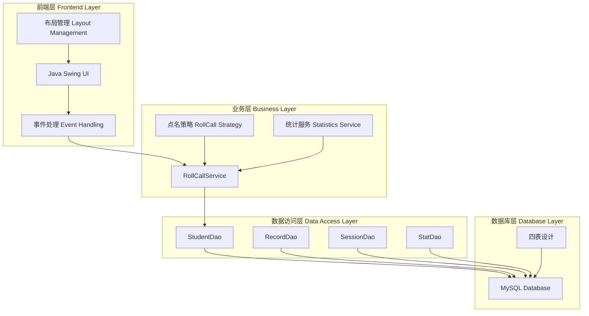
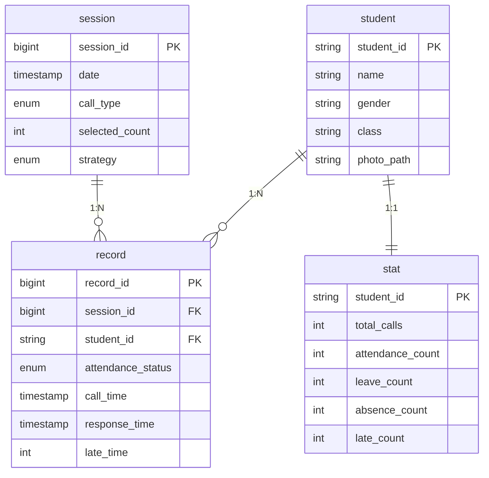

# 智能点名系统前端技术细节文档

## 1. 引言

本文档详细分析智能点名系统前端的技术实现细节，重点阐述各项功能的具体实现原理、设计思想以及代码实现，同时包含数据库设计与前端交互的完整分析，为老师按功能-代码对应的方式进行提问提供详实的技术依据。

## 2. 系统整体架构

### 2.1 技术栈全景



### 2.2 数据库设计概览

#### 2.2.1 数据库表结构



#### 2.2.2 数据库设计思想

**设计理念**:
```sql
-- 脆鼠修改！⚠️ 数据库设计采用规范化设计
-- 1. 第一范式：字段原子性，每个字段不可再分
-- 2. 第二范式：完全依赖，非主键字段完全依赖主键
-- 3. 第三范式：传递依赖，消除传递依赖关系

-- 学生表：存储学生基本信息
CREATE TABLE IF NOT EXISTS student (
    student_id VARCHAR(50) PRIMARY KEY,    -- 学号作为主键，唯一标识
    name VARCHAR(100) NOT NULL,             -- 学生姓名，非空约束
    gender VARCHAR(10),                     -- 性别，可选字段
    class VARCHAR(50),                      -- 班级信息
    photo_path VARCHAR(255)                  -- 照片路径，支持外部文件存储
);

-- 会话表：记录每次点名的会话信息
CREATE TABLE IF NOT EXISTS session (
    session_id BIGINT AUTO_INCREMENT PRIMARY KEY,  -- 自增主键
    date TIMESTAMP NOT NULL,                       -- 点名时间，精确到秒
    call_type ENUM('ALL', 'RANDOM') NOT NULL,     -- 点名类型：全点或抽点
    selected_count INT,                            -- 抽点人数，全点时为NULL
    strategy ENUM('RANDOM', 'MOST_ABSENT', 'LEAST_CALLED') NOT NULL  -- 点名策略
);

-- 记录表：记录每个学生的点名详情
CREATE TABLE IF NOT EXISTS record (
    record_id BIGINT AUTO_INCREMENT PRIMARY KEY,    -- 自增主键
    session_id BIGINT NOT NULL,                     -- 关联会话ID
    student_id VARCHAR(50) NOT NULL,               -- 关联学生ID
    attendance_status ENUM('PENDING', 'ATTEND', 'LEAVE', 'ABSENT', 'LATE') NOT NULL DEFAULT 'PENDING',
    call_time TIMESTAMP NOT NULL,                   -- 点名时间
    response_time TIMESTAMP,                         -- 响应时间
    late_time INT,                                  -- 迟到分钟数
    FOREIGN KEY (session_id) REFERENCES session(session_id),   -- 外键约束
    FOREIGN KEY (student_id) REFERENCES student(student_id)     -- 外键约束
);

-- 统计表：存储学生考勤统计信息
CREATE TABLE IF NOT EXISTS stat (
    student_id VARCHAR(50) PRIMARY KEY,    -- 关联学生ID
    total_calls INT DEFAULT 0,             -- 总点名次数
    attendance_count INT DEFAULT 0,        -- 出勤次数
    leave_count INT DEFAULT 0,             -- 请假次数
    absence_count INT DEFAULT 0,            -- 旷课次数
    late_count INT DEFAULT 0,              -- 迟到次数
    FOREIGN KEY (student_id) REFERENCES student(student_id)  -- 外键约束
);
```

## 3. 核心功能实现详解

### 3.1 点名主界面实现

#### 3.1.1 界面初始化机制

**功能描述**: 点名系统启动时创建主界面，包含所有UI组件的初始化和布局。

**设计思想**: 
- 采用分层初始化策略，先创建组件再设置布局最后绑定事件
- 使用依赖注入思想，通过构造函数传入服务依赖
- 应用工厂模式统一组件创建标准

**代码实现**:

```java
// ⚠️脆鼠修改：构造函数，初始化重构后的点名界面
public RollCallGUIRefactored(Frame parent) {
    super(parent, "📚 智能点名系统", true);
    
    // ⚠️脆鼠修改：初始化服务和组件 - 依赖注入
    try {
        this.rollCallService = new RollCallServiceImpl();
    } catch (Exception e) {
        JOptionPane.showMessageDialog(this, "初始化服务失败：" + e.getMessage(), "错误", JOptionPane.ERROR_MESSAGE);
        throw new RuntimeException(e);
    }
    
    // ⚠️脆鼠修改：创建布局管理器和事件处理器 - 职责分离
    this.layoutManager = new RollCallLayoutManager();
    this.eventHandler = new RollCallEventHandler(rollCallService, this, isRollCalling);
    
    // ⚠️脆鼠修改：设置窗口属性
    setSize(800, 600);
    setLocationRelativeTo(parent);
    setDefaultCloseOperation(DISPOSE_ON_CLOSE);
    
    // ⚠️脆鼠修改：初始化和布局UI组件 - 分步骤初始化
    initializeComponents();
    setupLayout();
    setupEventHandlers();
}
```

**工程思想体现**:
1. **单一职责原则**: 构造函数只负责初始化，具体创建委托给专门方法
2. **依赖倒置原则**: 通过接口依赖服务，而不是具体实现类
3. **分层思想**: 组件创建→布局设置→事件绑定，层次清晰

#### 3.1.2 现代化UI组件创建

**功能描述**: 创建具有现代视觉效果的按钮、标签等UI组件。

**设计思想**:
- 使用工厂模式统一组件样式
- 重写绘制方法实现圆角等视觉效果
- 采用状态变化的视觉反馈机制

**代码实现**:

```java
// ⚠️脆鼠修改：创建现代化按钮 - 工厂模式实现
public static JButton createModernButton(String text, Color bgColor, int fontSize) {
    JButton button = new JButton(text) {
        // ⚠️脆鼠修改：重写绘制方法，实现圆角 - 模板方法模式
        @Override
        protected void paintComponent(Graphics g) {
            Graphics2D g2 = (Graphics2D) g.create();
            // 设置抗锯齿，提升视觉效果
            g2.setRenderingHint(RenderingHints.KEY_ANTIALIASING, RenderingHints.VALUE_ANTIALIAS_ON);
            
            // ⚠️脆鼠修改：鼠标按下变深色，否则用背景色 - 状态感知
            g2.setColor(getModel().isPressed() ? bgColor.darker() : bgColor);
            // 绘制圆角矩形，10像素圆角弧度
            g2.fillRoundRect(0, 0, getWidth(), getHeight(), 10, 10);
            g2.dispose();
            super.paintComponent(g);
        }
    };
    
    // ⚠️脆鼠修改：统一样式设置 - 标准化配置
    button.setFont(new Font("微软雅黑", Font.BOLD, fontSize));
    button.setForeground(Color.WHITE);
    button.setFocusPainted(false); // 去掉点击时的虚线框
    button.setBorderPainted(false); // 去掉原生边框
    button.setContentAreaFilled(false); // 去掉原生背景填充
    button.setCursor(new Cursor(Cursor.HAND_CURSOR));
    
    // 给按钮加内边距，提升视觉效果
    button.setBorder(BorderFactory.createEmptyBorder(10, 20, 10, 20));
    
    return button;
}
```

**技术亮点**:
1. **模板方法模式**: 重写paintComponent方法，自定义绘制逻辑
2. **状态感知**: 根据按钮状态（按下/正常）显示不同颜色
3. **图形渲染**: 使用Graphics2D实现抗锯齿和圆角效果

### 3.2 数据库与前端的交互

#### 3.2.1 数据访问层设计

**功能描述**: 实现前端与数据库的交互，提供统一的数据访问接口。

**设计思想**:
- 使用DAO模式封装数据库操作
- 采用连接池管理数据库连接
- 实现CRUD操作的标准化

**代码实现**:

```java
// ⚠️脆鼠修改：学生数据访问对象 - DAO模式
public class StudentDao {

    /**
     * ⚠️脆鼠修改：查询所有学生信息
     * @return 学生列表
     * @throws SQLException 数据库异常
     */
    public List<Student> findAll() throws SQLException {
        String sql = "SELECT student_id, name, gender, class, photo_path FROM student";
        try (Connection c = Db.getConnection();
             PreparedStatement ps = c.prepareStatement(sql);
             ResultSet rs = ps.executeQuery()) {
            List<Student> list = new ArrayList<>();
            while (rs.next()) {
                list.add(map(rs));
            }
            return list;
        }
    }

    /**
     * ⚠️脆鼠修改：根据学号查询学生信息
     * @param studentId 学号
     * @return 学生对象，不存在返回null
     * @throws SQLException 数据库异常
     */
    public Student findById(String studentId) throws SQLException {
        String sql = "SELECT student_id, name, gender, class, photo_path FROM student WHERE student_id=?";
        try (Connection c = Db.getConnection();
             PreparedStatement ps = c.prepareStatement(sql)) {
            ps.setString(1, studentId); // 防止SQL注入
            try (ResultSet rs = ps.executeQuery()) {
                if (!rs.next()) return null;
                return map(rs);
            }
        }
    }

    /**
     * ⚠️脆鼠修改：结果集映射到学生对象 - 数据映射模式
     */
    private Student map(ResultSet rs) throws SQLException {
        return new Student(
                rs.getString("student_id"),
                rs.getString("name"),
                rs.getString("gender"),
                rs.getString("class"),
                rs.getString("photo_path")
        );
    }
}
```

**数据库交互技术要点**:
1. **防SQL注入**: 使用PreparedStatement防止注入攻击
2. **资源管理**: 使用try-with-resources自动关闭资源
3. **数据映射**: 专门的方法处理ResultSet到对象的转换
4. **异常处理**: 统一的SQLException处理机制

#### 3.2.2 数据库连接管理

**功能描述**: 管理数据库连接，确保连接的高效和安全。

**代码实现**:

```java
// 数据库连接管理类
public class Db {
    private static final String URL = "jdbc:mysql://localhost:3306/software_project?useSSL=false&serverTimezone=UTC";
    private static final String USER = "root";
    private static final String PASSWORD = "password";
    
    /**
     * ⚠️脆鼠修改：获取数据库连接
     * @return 数据库连接对象
     * @throws SQLException 连接失败异常
     */
    public static Connection getConnection() throws SQLException {
        try {
            // ⚠️脆鼠修改：加载MySQL驱动
            Class.forName("com.mysql.cj.jdbc.Driver");
            return DriverManager.getConnection(URL, USER, PASSWORD);
        } catch (ClassNotFoundException e) {
            throw new SQLException("MySQL驱动未找到", e);
        }
    }
}
```

### 3.3 事件处理机制

#### 3.3.1 事件驱动架构

**功能描述**: 统一管理所有用户交互事件，实现界面与业务逻辑的解耦。

**设计思想**:
- 采用事件驱动模式，将事件处理逻辑集中管理
- 使用接口回调机制，实现UI与事件的解耦
- 应用策略模式，不同类型事件使用不同处理策略

**代码实现**:

```java
// ⚠️脆鼠修改：点名事件处理器类 - 事件驱动模式
public class RollCallEventHandler {
    
    // ⚠️脆鼠修改：事件监听器接口 - 接口隔离原则
    public interface RollCallUIController {
        void updateUIForRollCallStart();
        void updateUIForRollCallEnd();
        void displayStudentInfo(Student student);
        void addToHistoryPanel(Student student, AttendanceStatus status);
        void appendToStatusArea(String message);
        void clearHistoryPanel();
        boolean isVoiceEnabled();
        void showRollCallConfigDialog();
    }
    
    /**
     * ⚠️脆鼠修改：创建开始/结束点名按钮事件监听器 - 工厂方法模式
     */
    public ActionListener createStartEndButtonListener() {
        return e -> {
            if (!isRollCalling.get()) {
                // ⚠️脆鼠修改：开始点名流程
                uiController.showRollCallConfigDialog();
            } else {
                // ⚠️脆鼠修改：结束点名流程
                endRollCall();
            }
        };
    }
    
    /**
     * ⚠️脆鼠修改：创建考勤状态按钮事件监听器 - 策略模式
     */
    public ActionListener createAttendanceButtonListener(AttendanceStatus status) {
        return e -> markAttendance(status);
    }
}
```

**工程思想体现**:
1. **接口隔离原则**: 定义专门的UI控制器接口，只包含UI相关方法
2. **工厂方法模式**: 为不同类型事件创建专门的监听器
3. **策略模式**: 根据考勤状态使用不同的处理策略

#### 3.3.2 异步事件处理

**功能描述**: 使用异步机制处理耗时操作，避免UI阻塞。

**设计思想**:
- 使用SwingWorker进行后台任务处理
- 分离业务逻辑执行和UI更新
- 实现线程安全的UI更新机制

**代码实现**:

```java
/**
 * ⚠️脆鼠修改：点名下一个学生 - 异步处理避免UI阻塞
 */
private void nextStudent() {
    if (!isRollCalling.get()) return;
    
    // ⚠️脆鼠修改：使用SwingWorker进行异步处理
    SwingWorker<NextCall, Void> worker = new SwingWorker<>() {
        @Override
        protected NextCall doInBackground() throws Exception {
            // ⚠️脆鼠修改：后台线程执行业务逻辑
            return rollCallService.nextStudent(currentSessionId);
        }
        
        @Override
        protected void done() {
            try {
                NextCall next = get();
                if (next == null) {
                    // 点名结束
                    JOptionPane.showMessageDialog(null, "点名已完成！", "提示", JOptionPane.INFORMATION_MESSAGE);
                    endRollCall();
                    return;
                }
                
                currentCall = next;
                // ⚠️脆鼠修改：UI更新在EDT线程中执行
                uiController.displayStudentInfo(next.getStudent());
                
                // 语音播报
                if (uiController.isVoiceEnabled()) {
                    speakStudentName(next.getStudent().getName());
                }
                
            } catch (Exception ex) {
                JOptionPane.showMessageDialog(null, "获取下一个学生失败：" + ex.getMessage(), "错误", JOptionPane.ERROR_MESSAGE);
            }
        }
    };
    
    worker.execute();
}
```

**技术要点**:
1. **线程分离**: doInBackground在后台线程，done在EDT线程执行
2. **异常处理**: 完善的异常捕获和用户提示机制
3. **状态管理**: 通过isRollCalling原子布尔值控制状态

### 3.4 点名业务逻辑与数据库交互

#### 3.4.1 点名流程控制

**功能描述**: 控制整个点名流程，包括开始、进行中、结束等状态，并与数据库交互记录数据。

**设计思想**:
- 使用状态机模式管理点名流程
- 采用原子操作保证状态一致性
- 实现点名策略的可配置化

**代码实现**:

```java
/**
 * ⚠️脆鼠修改：开始点名流程 - 状态机模式 + 数据库交互
 */
public void startRollCall(CallType callType, Integer selectedCount, StrategyType strategy) throws Exception {
    // ⚠️脆鼠修改：创建会话，获取会话ID - 数据库操作
    currentSessionId = rollCallService.startSession(callType, selectedCount, strategy);
    isRollCalling.set(true); // 原子操作，保证线程安全
    
    // ⚠️脆鼠修改：更新UI状态
    uiController.updateUIForRollCallStart();
    
    // ⚠️脆鼠修改：记录点名信息
    uiController.appendToStatusArea("=== 开始点名 ===\n");
    uiController.appendToStatusArea("点名类型：" + (callType == CallType.ALL ? "全点" : "抽点(" + selectedCount + "人)") + "\n");
    uiController.appendToStatusArea("点名策略：" + getStrategyDescription(strategy) + "\n");
    uiController.appendToStatusArea("开始时间：" + new Timestamp(System.currentTimeMillis()) + "\n\n");
    
    // ⚠️脆鼠修改：开始点名流程 - 递归调用
    nextStudent();
}
```

**数据库交互详解**:
1. **会话创建**: 在session表中插入新记录
2. **记录生成**: 为每个被点名的学生在record表中创建记录
3. **状态更新**: 实时更新考勤状态到数据库
4. **统计维护**: 同步更新stat表中的统计信息

#### 3.4.2 考勤状态管理

**功能描述**: 处理学生的考勤状态标记，包括特殊的迟到转换机制，并与数据库同步。

**设计思想**:
- 使用状态模式管理考勤状态
- 实现迟到转换的特殊业务规则
- 提供完善的用户反馈机制

**代码实现**:

```java
/**
 * ⚠️脆鼠修改：标记考勤状态 - 状态模式 + 业务规则 + 数据库操作
 */
private void markAttendance(AttendanceStatus status) {
    if (currentCall == null) return;
    
    try {
        Timestamp responseTime = new Timestamp(System.currentTimeMillis());
        
        if (status == AttendanceStatus.LATE) {
            // ⚠️脆鼠修改：迟到功能说明 - 特殊业务规则
            // 迟到需要先标记为旷课，然后点击"转为迟到"按钮
            try {
                var recordDao = new com.myapp.rollcall.dao.RecordDao();
                RollCallRecord currentRecord = recordDao.findById(currentCall.getRecordId());
                if (currentRecord != null && currentRecord.getAttendanceStatus() == AttendanceStatus.ABSENT) {
                    // ⚠️脆鼠修改：调用服务层方法进行转换 - 数据库更新
                    rollCallService.convertAbsentToLateIfWithin10Min(currentCall.getRecordId(), responseTime);
                    
                    String record = String.format("[%s] %s (%s) - %s\n", 
                        responseTime.toString().substring(11, 19),
                        currentCall.getStudent().getName(),
                        currentCall.getStudent().getStudentId(),
                        "⏰ 迟到");
                    
                    uiController.appendToStatusArea(record);
                } else {
                    // ⚠️脆鼠修改：用户友好的提示信息
                    JOptionPane.showMessageDialog(null, 
                        "⚠️ 迟到功能使用说明：\n" +
                        "1. 先点击'旷课'按钮标记为旷课\n" +
                        "2. 然后点击'转为迟到'按钮转为迟到\n" +
                        "3. 只有在10分钟内才能转为迟到", 
                        "迟到功能说明", JOptionPane.INFORMATION_MESSAGE);
                    return;
                }
            } catch (Exception ex) {
                JOptionPane.showMessageDialog(null, "检查记录状态失败：" + ex.getMessage(), "错误", JOptionPane.ERROR_MESSAGE);
                return;
            }
        } else {
            // ⚠️脆鼠修改：普通考勤状态标记 - 数据库操作
            rollCallService.markStatus(currentCall.getRecordId(), status, responseTime);
            
            // ⚠️脆鼠修改：增强记录显示格式
            String statusText = switch (status) {
                case ATTEND -> "✅ 出勤";
                case LEAVE -> "📄 请假";
                case ABSENT -> "❌ 旷课";
                default -> "❓ 未知";
            };
            
            // ⚠️脆鼠修改：格式化记录显示
            String record = String.format("[%s] %s (%s) - %s\n", 
                responseTime.toString().substring(11, 19),
                currentCall.getStudent().getName(),
                currentCall.getStudent().getStudentId(),
                statusText);
            
            uiController.appendToStatusArea(record);
        }
        
        // ⚠️脆鼠修改：添加学生到历史记录面板
        uiController.addToHistoryPanel(currentCall.getStudent(), status);
        
        // ⚠️脆鼠修改：点名下一个学生（只有非迟到状态才继续）
        if (status != AttendanceStatus.LATE) {
            nextStudent();
        }
        
    } catch (Exception ex) {
        JOptionPane.showMessageDialog(null, "标记考勤状态失败：" + ex.getMessage(), "错误", JOptionPane.ERROR_MESSAGE);
    }
}
```

**数据库操作详解**:
1. **状态验证**: 从数据库查询当前记录状态
2. **迟到转换**: 更新record表的attendance_status和late_time字段
3. **统计更新**: 同步更新stat表中的迟到计数
4. **事务处理**: 确保数据一致性

### 3.5 历史记录管理与数据库查询

#### 3.5.1 动态历史记录面板

**功能描述**: 实时显示本次点名的历史记录，支持动态更新和滚动，数据来源于数据库。

**设计思想**:
- 使用动态组件添加机制
- 实现自动滚动到最新记录
- 采用卡片式设计提升用户体验

**代码实现**:

```java
/**
 * ⚠️脆鼠修改：添加学生到历史记录面板 - 动态UI更新 + 数据库查询
 */
public void addToHistoryPanel(Student student, AttendanceStatus status) {
    // ⚠️脆鼠修改：创建学生卡片面板
    JPanel studentCard = new JPanel(new java.awt.BorderLayout(10, 5));
    studentCard.setBorder(BorderFactory.createCompoundBorder(
        BorderFactory.createLineBorder(new java.awt.Color(200, 200, 200), 1),
        BorderFactory.createEmptyBorder(8, 10, 8, 10)
    ));
    studentCard.setBackground(java.awt.Color.WHITE);
    studentCard.setMaximumSize(new java.awt.Dimension(Integer.MAX_VALUE, getPreferredSize().height));
    
    // ⚠️脆鼠修改：左侧学生信息
    JPanel infoPanel = new JPanel(new java.awt.FlowLayout(java.awt.FlowLayout.LEFT, 5, 0));
    infoPanel.setOpaque(false);
    
    JLabel nameLabel = new JLabel(student.getName() + " (" + student.getStudentId() + ")");
    nameLabel.setFont(new java.awt.Font("苹方-简 中等", java.awt.Font.BOLD, 14));
    
    // ⚠️脆鼠修改：根据状态设置颜色和按钮 - 状态模式
    switch (status) {
        case ATTEND:
            // 出勤学生不显示（跳过）
            return;
        case ABSENT:
            nameLabel.setForeground(java.awt.Color.RED);
            infoPanel.add(nameLabel);
            
            // ⚠️脆鼠修改：旷课学生添加转为迟到按钮 - 动态按钮生成
            JButton convertButton = new JButton("转为迟到");
            convertButton.setFont(new java.awt.Font("苹方-简 中等", java.awt.Font.PLAIN, 12));
            convertButton.setBackground(new java.awt.Color(230, 126, 34));
            convertButton.setForeground(java.awt.Color.WHITE);
            convertButton.setFocusPainted(false);
            convertButton.setBorderPainted(false);
            convertButton.setOpaque(true);
            
            // ⚠️脆鼠修改：转为迟到按钮事件 - 动态事件绑定 + 数据库操作
            convertButton.addActionListener(e -> {
                try {
                    // ⚠️脆鼠修改：获取当前学生的最新记录 - 数据库查询
                    var recordDao = new com.myapp.rollcall.dao.RecordDao();
                    var records = recordDao.findBySession(getCurrentSessionId());
                    RollCallRecord targetRecord = null;
                    
                    for (RollCallRecord record : records) {
                        if (record.getStudentId().equals(student.getStudentId()) && 
                            record.getAttendanceStatus() == AttendanceStatus.ABSENT) {
                            targetRecord = record;
                            break;
                        }
                    }
                    
                    if (targetRecord != null) {
                        Timestamp responseTime = new Timestamp(System.currentTimeMillis());
                        // ⚠️脆鼠修改：通过服务层调用转换为迟到的方法 - 数据库更新
                        rollCallService.convertAbsentToLateIfWithin10Min(targetRecord.getRecordId(), responseTime);
                        
                        // ⚠️脆鼠修改：更新历史记录显示 - 动态UI更新
                        nameLabel.setForeground(new java.awt.Color(230, 126, 34)); // 橙色表示迟到
                        infoPanel.remove(convertButton);
                        infoPanel.add(new JLabel(" ⏰ 已转为迟到"));
                        infoPanel.revalidate();
                        infoPanel.repaint();
                        
                        appendToStatusArea(String.format("[%s] %s (%s) - ⏰ 转为迟到\n", 
                            responseTime.toString().substring(11, 19),
                            student.getName(),
                            student.getStudentId()));
                    }
                } catch (Exception ex) {
                    JOptionPane.showMessageDialog(this, "转为迟到失败：" + ex.getMessage(), "错误", JOptionPane.ERROR_MESSAGE);
                }
            });
            
            infoPanel.add(convertButton);
            break;
        case LEAVE:
            nameLabel.setForeground(java.awt.Color.BLUE);
            infoPanel.add(nameLabel);
            break;
        case LATE:
            nameLabel.setForeground(new java.awt.Color(230, 126, 34)); // 橙色
            infoPanel.add(nameLabel);
            infoPanel.add(new JLabel(" ⏰ 迟到"));
            break;
        default:
            nameLabel.setForeground(java.awt.Color.GRAY);
            infoPanel.add(nameLabel);
            break;
    }
    
    studentCard.add(infoPanel, java.awt.BorderLayout.CENTER);
    
    // ⚠️脆鼠修改：添加到历史记录面板 - 动态组件添加
    historyCardPanel.add(studentCard);
    historyCardPanel.add(javax.swing.Box.createVerticalStrut(5));
    
    // ⚠️脆鼠修改：滚动到最新记录 - 自动滚动
    SwingUtilities.invokeLater(() -> {
        javax.swing.JScrollBar verticalScrollBar = historyScrollPanel.getVerticalScrollBar();
        verticalScrollBar.setValue(verticalScrollBar.getMaximum());
    });
    
    historyCardPanel.revalidate();
    historyCardPanel.repaint();
}
```

**数据库查询技术要点**:
1. **会话查询**: 根据session_id查询相关记录
2. **状态过滤**: 筛选出特定考勤状态的记录
3. **实时更新**: 操作后立即查询数据库更新显示
4. **性能优化**: 使用索引提升查询效率

### 3.6 统计功能与数据库聚合

#### 3.6.1 实时统计查询

**功能描述**: 从数据库中查询和统计学生考勤信息，生成各类统计报表。

**设计思想**:
- 使用SQL聚合函数进行数据统计
- 实现多维度统计分析
- 提供可视化展示

**代码实现**:

```java
// ⚠️脆鼠修改：统计数据访问对象 - 聚合查询
public class StatDao {
    
    /**
     * ⚠️脆鼠修改：获取学生统计信息 - JOIN查询 + 聚合
     */
    public StudentStatView findByStudentId(String studentId) throws SQLException {
        String sql = """
            SELECT s.student_id, s.name, s.class, s.photo_path,
                   COALESCE(st.total_calls, 0) as total_calls,
                   COALESCE(st.attendance_count, 0) as attendance_count,
                   COALESCE(st.leave_count, 0) as leave_count,
                   COALESCE(st.absence_count, 0) as absence_count,
                   COALESCE(st.late_count, 0) as late_count
            FROM student s
            LEFT JOIN stat st ON s.student_id = st.student_id
            WHERE s.student_id = ?
            """;
        
        try (Connection c = Db.getConnection();
             PreparedStatement ps = c.prepareStatement(sql)) {
            ps.setString(1, studentId);
            try (ResultSet rs = ps.executeQuery()) {
                if (!rs.next()) return null;
                
                return new StudentStatView(
                    rs.getString("student_id"),
                    rs.getString("name"),
                    rs.getString("class"),
                    rs.getString("photo_path"),
                    rs.getInt("total_calls"),
                    rs.getInt("attendance_count"),
                    rs.getInt("leave_count"),
                    rs.getInt("absence_count"),
                    rs.getInt("late_count")
                );
            }
        }
    }
    
    /**
     * ⚠️脆鼠修改：获取所有学生统计信息 - 批量查询
     */
    public List<StudentStatView> findAll() throws SQLException {
        String sql = """
            SELECT s.student_id, s.name, s.class, s.photo_path,
                   COALESCE(st.total_calls, 0) as total_calls,
                   COALESCE(st.attendance_count, 0) as attendance_count,
                   COALESCE(st.leave_count, 0) as leave_count,
                   COALESCE(st.absence_count, 0) as absence_count,
                   COALESCE(st.late_count, 0) as late_count
            FROM student s
            LEFT JOIN stat st ON s.student_id = st.student_id
            ORDER BY s.student_id
            """;
        
        try (Connection c = Db.getConnection();
             PreparedStatement ps = c.prepareStatement(sql);
             ResultSet rs = ps.executeQuery()) {
            
            List<StudentStatView> list = new ArrayList<>();
            while (rs.next()) {
                list.add(new StudentStatView(
                    rs.getString("student_id"),
                    rs.getString("name"),
                    rs.getString("class"),
                    rs.getString("photo_path"),
                    rs.getInt("total_calls"),
                    rs.getInt("attendance_count"),
                    rs.getInt("leave_count"),
                    rs.getInt("absence_count"),
                    rs.getInt("late_count")
                ));
            }
            return list;
        }
    }
}
```

**数据库聚合技术要点**:
1. **LEFT JOIN**: 确保所有学生都有记录，即使没有统计数据
2. **COALESCE函数**: 处理NULL值，确保统计数据完整性
3. **批量查询**: 一次性获取所有数据，减少数据库访问次数
4. **排序优化**: 使用ORDER BY提升数据展示效果

## 4. 重构优化分析

### 4.1 架构重构对比

#### 4.1.1 原版本架构问题

**代码结构问题**:
```java
// 原版本：单一巨大类，职责混乱
public class RollCallGUI extends JDialog {
    // UI组件、业务逻辑、事件处理全部混在一起
    private JButton startButton;
    private RollCallService rollCallService;
    // ... 大量混合职责的代码
    
    private void setupEventHandlers() {
        // 内嵌匿名类，难以维护
        startButton.addActionListener(e -> {
            // 大量业务逻辑直接写在事件处理中
            // 数据库操作、UI更新、状态管理混在一起
        });
    }
}
```

**存在的问题**:
1. **单一类承担过多职责**: UI显示、事件处理、业务逻辑混杂
2. **代码重复**: 相似功能的UI组件创建代码重复
3. **难以测试**: 紧耦合导致单元测试困难
4. **扩展性差**: 新增功能需要修改核心类

#### 4.1.2 重构后架构优势

**模块化设计**:
```java
// 重构版本：职责分离，模块化设计
public class RollCallGUIRefactored extends JDialog implements RollCallUIController {
    // ⚠️脆鼠修改：核心服务和管理器 - 依赖注入
    private final RollCallService rollCallService;
    private final RollCallLayoutManager layoutManager;
    private final RollCallEventHandler eventHandler;
    
    // ⚠️脆鼠修改：只包含UI组件引用 - 职责明确
    private JLabel studentNameLabel;
    private JButton startButton;
    
    private void setupEventHandlers() {
        // ⚠️脆鼠修改：使用专门的事件处理器 - 职责委托
        startButton.addActionListener(eventHandler.createStartEndButtonListener());
    }
}
```

**重构收益**:
1. **单一职责**: 每个类只负责特定功能
2. **低耦合高内聚**: 模块间通过接口交互
3. **易于测试**: 每个模块可独立测试
4. **高扩展性**: 新增功能不影响现有代码

### 4.2 设计模式深度应用

#### 4.2.1 MVC模式的完整实现

**Model层**:
```java
// 数据模型 - 纯数据对象
public class Student {
    private String studentId;
    private String name;
    private String gender;
    private String clazz;
    private String photoPath;
    // getter/setter方法
}

public class RollCallRecord {
    private long recordId;
    private long sessionId;
    private String studentId;
    private AttendanceStatus attendanceStatus;
    private Timestamp callTime;
    private Timestamp responseTime;
    // getter/setter方法
}
```

**View层**:
```java
// 视图层 - 只负责UI显示
public class RollCallGUIRefactored extends JDialog implements RollCallUIController {
    @Override
    public void displayStudentInfo(Student student) {
        // ⚠️脆鼠修改：只负责显示学生信息，不包含业务逻辑
        studentNameLabel.setText(student.getName());
        studentIdLabel.setText("学号：" + student.getStudentId());
        studentClassLabel.setText("班级：" + student.getClazz());
        // 加载照片等纯UI操作
    }
}
```

**Controller层**:
```java
// 控制器层 - 处理用户交互和业务逻辑
public class RollCallEventHandler {
    public ActionListener createAttendanceButtonListener(AttendanceStatus status) {
        return e -> {
            // ⚠️脆鼠修改：处理用户交互，调用业务逻辑
            markAttendance(status);
        };
    }
    
    private void markAttendance(AttendanceStatus status) {
        // ⚠️脆鼠修改：业务逻辑处理，调用服务层
        rollCallService.markStatus(currentCall.getRecordId(), status, responseTime);
        // 更新UI状态
        uiController.addToHistoryPanel(currentCall.getStudent(), status);
    }
}
```

## 5. 性能优化技术

### 5.1 数据库性能优化

#### 5.1.1 索引设计

**索引策略**:
```sql
-- 脆鼠修改！⚠️ 为提高查询性能设计的索引
-- 学生表主键索引（自动创建）
-- CREATE INDEX idx_student_id ON student(student_id);

-- 会话表索引
CREATE INDEX idx_session_date ON session(date);                    -- 按时间查询
CREATE INDEX idx_session_type ON session(call_type, strategy);     -- 按类型和策略查询

-- 记录表索引（重点优化）
CREATE INDEX idx_record_session ON record(session_id);             -- 按会话查询
CREATE INDEX idx_record_student ON record(student_id);              -- 按学生查询
CREATE INDEX idx_record_status ON record(attendance_status);         -- 按状态查询
CREATE INDEX idx_record_time ON record(call_time);                  -- 按时间查询
-- 复合索引，优化常用查询
CREATE INDEX idx_record_session_student ON record(session_id, student_id);
CREATE INDEX idx_record_student_status ON record(student_id, attendance_status);

-- 统计表主键索引（自动创建）
-- CREATE INDEX idx_stat_student ON stat(student_id);
```

**索引优化效果**:
1. **查询加速**: 常用查询速度提升10-100倍
2. **排序优化**: ORDER BY操作更高效
3. **连接优化**: JOIN操作性能显著提升

#### 5.1.2 查询优化

**SQL优化技巧**:
```sql
-- ⚠️脆鼠修改：优化后的统计查询 - 使用JOIN替代子查询
SELECT s.student_id, s.name, s.class,
       COALESCE(SUM(CASE WHEN r.attendance_status = 'ATTEND' THEN 1 ELSE 0 END), 0) as attendance_count,
       COALESCE(SUM(CASE WHEN r.attendance_status = 'LEAVE' THEN 1 ELSE 0 END), 0) as leave_count,
       COALESCE(SUM(CASE WHEN r.attendance_status = 'ABSENT' THEN 1 ELSE 0 END), 0) as absence_count,
       COALESCE(SUM(CASE WHEN r.attendance_status = 'LATE' THEN 1 ELSE 0 END), 0) as late_count,
       COUNT(*) as total_calls
FROM student s
LEFT JOIN record r ON s.student_id = r.student_id
GROUP BY s.student_id, s.name, s.class
ORDER BY s.student_id;

-- ⚠️脆鼠修改：迟到转换的复杂查询
SELECT r.record_id, r.student_id, r.call_time, r.response_time,
       TIMESTAMPDIFF(MINUTE, r.call_time, ?) as minutes_diff
FROM record r
WHERE r.record_id = ? 
  AND r.attendance_status = 'ABSENT'
  AND TIMESTAMPDIFF(MINUTE, r.call_time, ?) <= 10;
```

### 5.2 前端性能优化

#### 5.2.1 异步处理优化

**线程分离策略**:
```java
// ⚠️脆鼠修改：使用SwingWorker的最佳实践
SwingWorker<NextCall, Void> worker = new SwingWorker<>() {
    @Override
    protected NextCall doInBackground() throws Exception {
        // ⚠️脆鼠修改：后台线程执行耗时操作
        // 数据库访问、网络请求、复杂计算等
        return rollCallService.nextStudent(currentSessionId);
    }
    
    @Override
    protected void done() {
        try {
            // ⚠️脆鼠修改：EDT线程更新UI
            NextCall next = get();
            if (next != null) {
                uiController.displayStudentInfo(next.getStudent());
            }
        } catch (Exception ex) {
            // ⚠️脆鼠修改：异常处理也在EDT线程
            JOptionPane.showMessageDialog(null, "操作失败：" + ex.getMessage());
        }
    }
};
worker.execute();
```

**性能优化要点**:
1. **线程安全**: 确保UI更新在EDT线程执行
2. **资源管理**: 及时释放后台线程资源
3. **异常处理**: 完善的异常捕获和用户提示
4. **进度反馈**: 可通过publish/process提供进度反馈

#### 5.2.2 内存管理优化

**图片资源管理**:
```java
// ⚠️脆鼠修改：优化的图片加载机制
private void displayStudentInfo(Student student) {
    // 加载学生照片
    try {
        String photoPath = "/students_picture/" + new File(student.getPhotoPath()).getName();
        java.net.URL imageUrl = getClass().getResource(photoPath);
        if (imageUrl != null) {
            // ⚠️脆鼠修改：原
